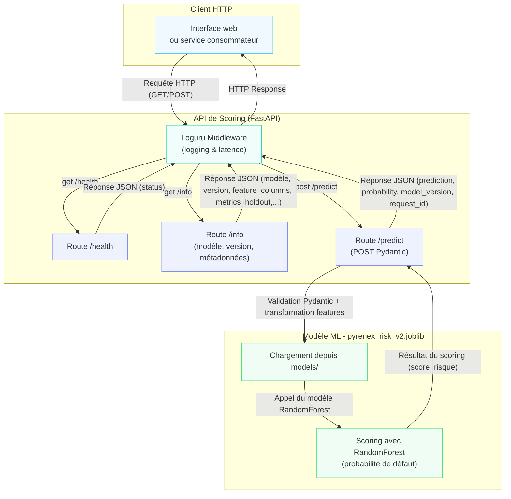
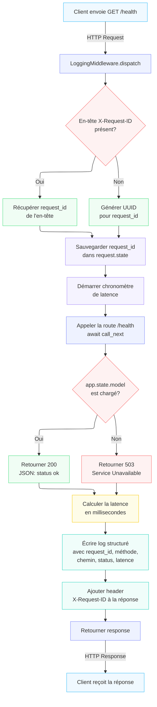
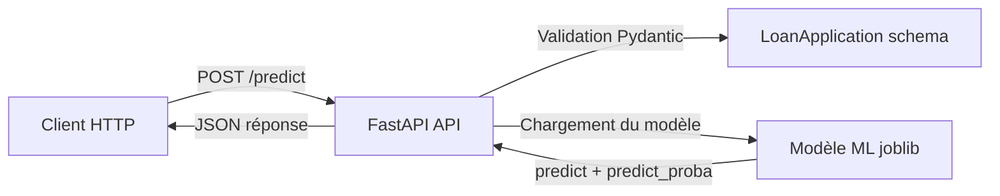

# M1-B2 — Squelette repo (Pyrenex Crédit scoring API)

> Ce repo contient une API FastAPI pour servir un modèle de scoring de crédit
> issu de la phase M1-B1. Il expose l’état du service, les métadonnées du
> modèle et une route de prédiction.

---

## Architecture



---

## 🚀 Démarrage rapide

```bash
# 1. Clone le repo et positionne-toi dans le dossier du projet
git clone git@github.com:rbatos/M1-B2-scoring-api-romain.git
cd M1-B2-scoring-api-romain

# 2. Crée l'environnement virtuel
uv venv --python 3.11
source .venv/bin/activate

# 3. Installe les dépendances
uv pip install -r requirements.txt

# 4. Lance le service
uvicorn app.main:app --reload
```

Ensuite, vérifie :

```bash
curl --noproxy localhost http://localhost:8000/health
curl --noproxy localhost http://localhost:8000/info
```

---

## 🚀 Démarrage conteunérisé

```bash
# 1. Build
docker build -t pyrenex-risk-api:v0.1.0 .

# 2. Run
docker run -d -p 8000:8000 --name pyrenex-api pyrenex-risk-api:v0.1.0

# 3. Vérifications
docker ps                                  # → STATUS doit contenir (healthy)
curl --noproxy localhost http://localhost:8000/health    # → {"status": "ok"}
curl --noproxy localhost http://localhost:8000/info      # → JSON métadonnées

# 4. Stop
docker stop pyrenex-api && docker rm pyrenex-api
```

---

## 🔑 ### **Versionning**

La version du modèle de scoring est traçable via deux sources complémentaires :

- **Endpoint `/info`** : L’API expose un endpoint REST (`GET /info`) qui retourne les métadonnées du modèle, incluant sa version (`"model_version":"v2.0.0"`), son nom (`"model_name":"pyrenex_risk_v2"`), la date de déploiement (`"model_created_at":"2026-06-02T14:24:03.520359+00:00"`)....
- **Tag Git** : Le dépôt Git du projet utilise des tags sémantiques (ex: `v2.0.1`) pour marquer les versions stables du modèle et du code. Ces tags sont alignés avec les versions déployées en production pour garantir la reproductibilité.

Pour vérifier la version en cours, exécutez :

```bash
curl --noproxy localhost http://localhost:8000/info
```

ou consultez les tags via :

```bash
git tag -l
```

Directement dans le fichier `models/pyrenex_risk_v2.json` (`"model_version": "v2.0.0"`)

---

## 📁 Structure du repo

```
M1-B2-scoring-api-<prenom>/
├── app/
│   ├── __init__.py
│   ├── main.py                  # FastAPI app + lifespan + routes
│   ├── schemas.py               # Pydantic schemas (LoanApplication, Prediction)
│   └── middleware.py            # LoggingMiddleware Loguru
├── scripts/
│   └── sanity_check.py          # sanity check modèle + métadonnées avant lancement
├── tests/
│   ├── __init__.py
│   ├── conftest.py              # fixtures pytest (client + valid_payload)
│   ├── test_model_contract.py   # test modèle avant l'API
│   └── test_api.py              # tests routes /health, /info, /predict
├── models/                      # ton .joblib + .json depuis M1-B1
│   └── .gitkeep
├── logs/                        # logs rotatifs (gitignored)
│   └── .gitkeep
├── ressources/                  # mini-cours d'appui
├── Dockerfile
├── Dockerfile.test
├── .dockerignore
├── .gitignore
├── requirements.txt
└── README.md
```

---

## Flux détaillé pas à pas d'une requête GET /health



---

## 📚 Mini-cours d'appui

Les **5 mini-cours pédagogiques** du brief sont fournis dans
[`./ressources/`](./ressources/). Lecture juste-à-temps, ~15-20 min chacun :

| Tâche | Mini-cours |
|---|---|
| Routes FastAPI + Pydantic ML | [`01_FastAPI_Pydantic_ml_essentiel.md`](./ressources/01_FastAPI_Pydantic_ml_essentiel.md) |
| Dockerfile Python production | [`02_Dockerfile_Python_essentiel.md`](./ressources/02_Dockerfile_Python_essentiel.md) |
| Tests pytest + TestClient | [`03_Pytest_TestClient_essentiel.md`](./ressources/03_Pytest_TestClient_essentiel.md) |
| Loguru middleware structuré | [`04_Loguru_middleware_essentiel.md`](./ressources/04_Loguru_middleware_essentiel.md) |
| Versionning sémantique modèle | [`05_Versionning_modele_essentiel.md`](./ressources/05_Versionning_modele_essentiel.md) |

Cf. [`./ressources/README.md`](./ressources/README.md) pour l'ordre de mobilisation détaillé.

---

## 📌 Modèle (depuis M1-B1)

**Avant de démarrer l'API**, copie ton modèle M1-B1 dans `models/` :

```bash
cp ../M1-B1-scoring-<prenom>/models/pyrenex_risk_v2.joblib ./models/
cp ../M1-B1-scoring-<prenom>/models/pyrenex_risk_v2.json   ./models/
```

⚠️ Le service ne démarre pas sans ces deux fichiers.

---

## 🛠️ Endpoints disponibles

### `GET /health`

- Réponse 200 si le modèle est chargé.
- Réponse 503 si le modèle n'est pas chargé.

### `GET /info`

Retourne les métadonnées du modèle chargé :

- `api_version`
- `model_name`
- `model_version`
- `model_created_at`
- `metrics_holdout`
- `sklearn_version`
- `dataset_sha256`
- `feature_columns`

### `POST /predict`

- Reçoit un objet JSON unique correspondant au schéma `LoanApplication`.
- Valide le payload via Pydantic.
- Convertit l'objet en DataFrame une ligne puis appelle le modèle.
- Retourne un objet `Prediction`.

#### Exemple de requête valide

```bash
curl --noproxy localhost \
  -H "Content-Type: application/json" \
  -H "X-Request-ID: de25d100-192f-4bce-ac34-efb318041234" \
  -X POST http://localhost:8000/predict \
  -d '{
    "loan_amnt": 7600,
    "term": "36 months",
    "int_rate": 11.39,
    "annual_inc": 72500,
    "purpose": "debt_consolidation",
    "installment": 250.22,
    "grade": "B",
    "emp_length": "3 years",
    "home_ownership": "MORTGAGE",
    "verification_status": "Verified",
    "dti": 13.12,
    "delinq_2yrs": 1,
    "fico_range_low": 725,
    "revol_util": 48.0
  }'
```

> Important : `/predict` attend un objet JSON, pas un tableau. Une requête
> `[{ ... }]` provoque une erreur `422`.

#### Exemple de réponse

```json
{
  "prediction": 0,
  "probability": 0.1234,
  "model_version": "v2.0.0",
  "request_id": "de25d100-192f-4bce-ac34-efb318041234"
}
```

---

## 📘 Schéma client → API → modèle



---

## 🧪 Vérification et tests

- Vérifie d'abord que `pytest -v` passe en local.
- Les tests doivent couvrir :
  - la charge du modèle et des métadonnées,
  - le endpoint `/health`,
  - le endpoint `/info`,
  - le contract `/predict`.
- `Dockerfile.test` peut être utilisé pour tester l'image en CI.

---

## ✅ Tâches et modifications appliquées

1. `scripts/sanity_check.py` est exécuté au démarrage pour valider :
   - la présence du `.joblib`,
   - la présence du `.json`,
   - la capacité à faire une prédiction sur une ligne de holdout.
2. `app/main.py` expose les routes `/health`, `/info`, `/predict`.
3. `app/schemas.py` définit les schémas d'entrée et de sortie `LoanApplication`
   et `Prediction`.
4. `app/middleware.py` trace chaque requêtes, ajoute `X-Request-ID` et enregistre
   les logs dans `logs/api.log`.
5. Le README est mis à jour pour refléter le comportement actuel de l'API,
   l'usage de `/predict` et les exemples concrets.

---

## ✅ Conventions de code

- Python 3.11+
- Type hints sur les signatures publiques
- Pas de `print` — utilisation de Loguru
- `pathlib.Path` pour les chemins
- Tests pytest avec fixtures
- Logs structurés en JSON dans `logs/api.log`

---

## 🆘 En cas de blocage

- Ouvre `http://localhost:8000/docs` pour tester l'API.
- Vérifie `logs/api.log` pour les erreurs.
- Assure-toi que `models/pyrenex_risk_v2.joblib` et
  `models/pyrenex_risk_v2.json` sont bien présents.
- Si `pytest` échoue en local, corrige avant de dockeriser.
- `docker logs <container>` montre les erreurs de container.

---

## ⭐ Préparation M5

Pour le module **M5**, préparez l’infrastructure de stockage et de versionnage du modèle :

1. Déplacez le modèle (`pyrenex_risk_v2.joblib`) dans **Git LFS** ou un **Object Storage** (S3/MinIO) pour éviter de surcharger le dépôt Git.
2. Associez le **tag Git** (ex: `v0.1.0`) à une **image Docker** (`pyrenex-risk-api:v0.1.0`) et poussez-la vers un **registry** (Docker Hub, GitHub CR, ECR) pour conserver l’historique des versions.
3. Modifiez l’API pour charger le **méta-fichier** (`pyrenex_risk_v2.json`) au démarrage du container et exposez ses métadonnées via `/info`.
4. Documentez dans `docs/deployment.md` les étapes de build, tagging et push de l’image Docker.
5. Validez via une PR et automatisez le déploiement en staging avec un workflow GitHub Actions lié au registry.